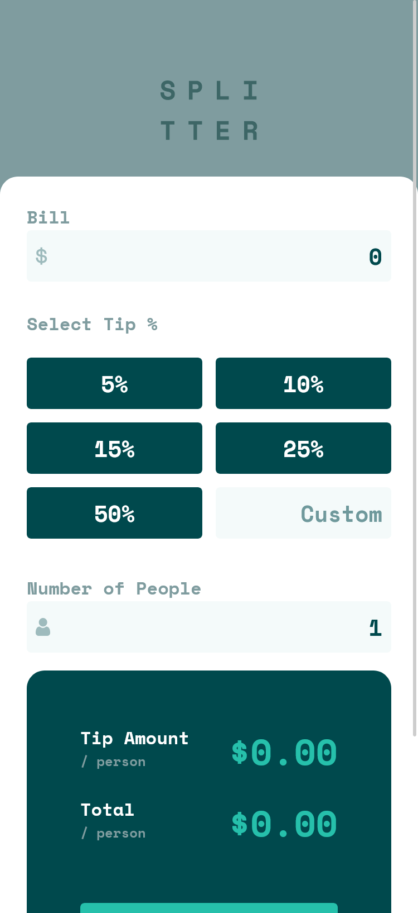
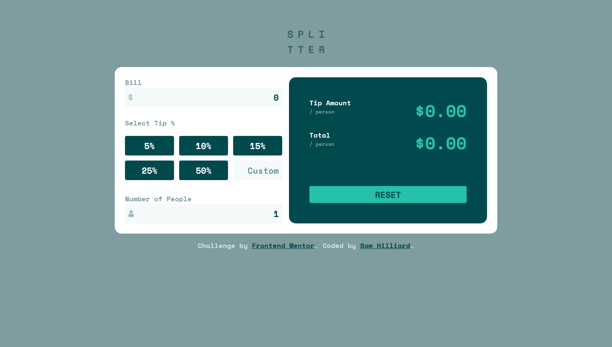

# Frontend Mentor - Tip calculator app solution

This is a solution to the [Tip calculator app challenge on Frontend Mentor](https://www.frontendmentor.io/challenges/tip-calculator-app-ugJNGbJUX). Frontend Mentor challenges help you improve your coding skills by building realistic projects.

## Table of contents

- [Frontend Mentor - Tip calculator app solution](#frontend-mentor---tip-calculator-app-solution)
  - [Table of contents](#table-of-contents)
  - [Overview](#overview)
    - [The challenge](#the-challenge)
    - [Screenshot](#screenshot)
    - [Links](#links)
  - [My process](#my-process)
    - [Built with](#built-with)
    - [What I learned](#what-i-learned)
    - [Continued development](#continued-development)
    - [Useful resources](#useful-resources)
  - [Author](#author)
  - [Acknowledgments](#acknowledgments)

## Overview

In this challenge I built a responsive tip calculator app using React.js.

### The challenge

Users should be able to:

- View the optimal layout for the app depending on their device's screen size
- See hover states for all interactive elements on the page
- Calculate the correct tip and total cost of the bill per person

### Screenshot

### Links

- Solution URL: [repo](https://github.com/sam-hilliard/tip-calculator-app)
- Live Site URL: [site](https://sam-hilliard.github.io/tip-calculator-app/)

## My process

Usually with every react project, removing all the bloat that comes with `create-react-app`
and getting the bare minimum working. Then, based off of the design, I decide how many components
I need. From there, I get the components set up and styled (mobile first) before I add any functionality.
Once it's looking right and responsive, I go in and add the necessary states, contexts, and effects to make
my app functional.

### Built with

- CSS custom properties
- Flexbox
- CSS Grid
- Mobile-first workflow
- [React](https://reactjs.org/) - JS library

### What I learned

I learned how to use React's context API more effectively and how to write cleaner code for my
components.

### Continued development

One thing I could improve on is to make my React code more modular. I felt that much of my code
could have been broken down further into components to make it more readable.

### Useful resources

- I completed Kevin Powell's [Conquering Responsive Layouts](https://www.kevinpowell.co/courses/) course
  in conjunction with finishing this challenge and it helped me get a better grasp of front end design.

## Author

- Website - [Sam Hilliard](https://sam-hilliard.github.io/)
- Frontend Mentor - [@samhill15](https://www.frontendmentor.io/profile/yourusername)

## Acknowledgments

Hats off to Kevin Powell for continually providing me with great free content that pushes me to become
a better developer and keep learning.